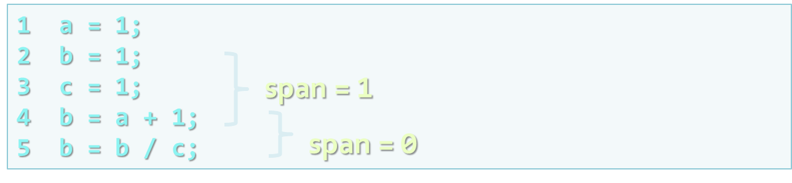
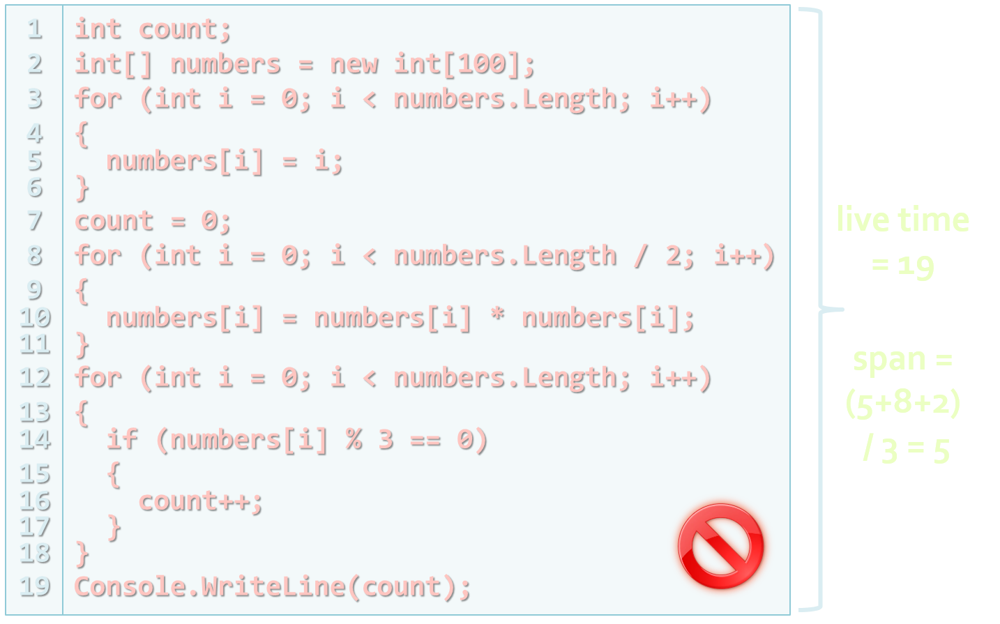
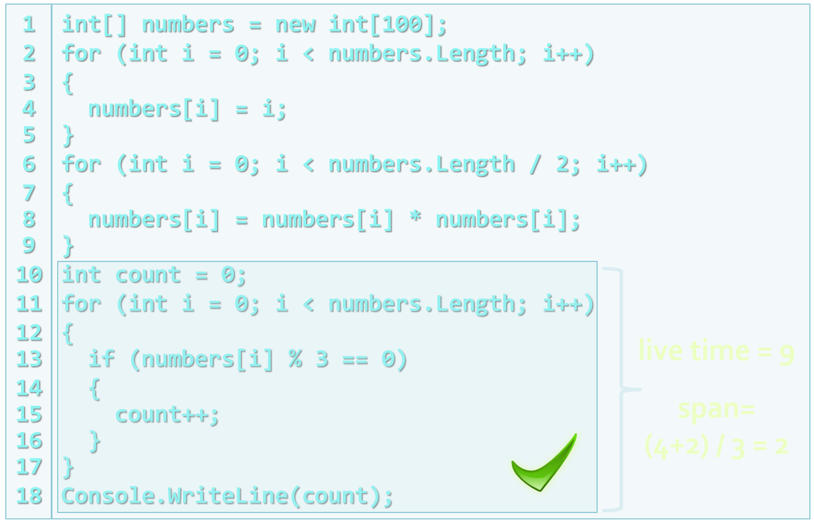
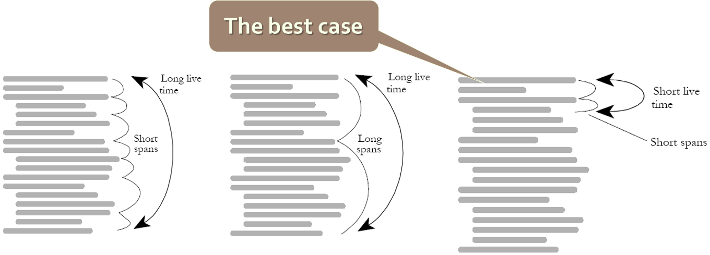

<!-- section start -->
<!-- attr: { id:'', class:'slide-title', showInPresentation:true, hasScriptWrapper:true } -->
# Correct Use of Variables, Data, Expressions and Constants
## Correctly Organizing Data and Expressions
<!--  -->
<div class="signature">
	<p class="signature-course">High-Quality Code - Part 1</p>
	<p class="signature-initiative">Telerik Software Academy</p>
	<a href="https://academy.telerik.com " class="signature-link">https://academy.telerik.com </a>
</div>


<!-- section start -->
<!-- attr: { id:'', showInPresentation:true, hasScriptWrapper:true } -->
# Table of Contents
- Principles for Initialization
- Scope, Lifetime, Span
- Using Variables
  - Variables Naming
  - Naming convention
  - Standard Prefixes
- Using Expressions
- Using Constants
<!--  -->


<!-- section start -->
<!-- attr: { id:'', class:'slide-section', showInPresentation:true, hasScriptWrapper:true } -->
<!-- # Principles for Initialization
## Best Practices -->


<!-- attr: { showInPresentation:true, hasScriptWrapper:true } -->
# Initially Assigned <br/> Variables in C&num;
- Static variables
- Instance variables of class instances
- Instance variables of initially assigned struct variables
- Array elements
- Value parameters
- Reference parameters
- Variables declared in a `catch` clause or a `foreach` statement
<!--  -->


<!-- attr: { showInPresentation:true, hasScriptWrapper:true } -->
# Initially Unassigned <br/> Variables in C&num;
- Instance variables of initially unassigned struct variables
- Output parameters
  - Including the `this` variable of struct instance constructors
- Local variables
  - Except those declared in a `catch` clause or a `foreach` statement


<!-- attr: { showInPresentation:true, hasScriptWrapper:true } -->
# Guidelines for Initializing Variables
- When the problems can happen?
  - The variable has never been assigned a value
  - The value in the variable is outdated
  - Part of the variable has been assigned a value and a part has not
    - E.g. **Student** class has initialized name, but faculty number is left unassigned
- Developing effective techniques for avoiding initialization problems can save a lot of time


<!-- attr: { showInPresentation:true, hasScriptWrapper:true } -->
# Variable Initialization
- Initialize all variables before their first usage
  - Local variables should be manually initialized
  - Declare and define each variable close to where it is used
  - This C# code will result in compiler error:

```cs
int value;
Console.WriteLine(value);
```
  - We can initialize the variable at its declaration:

```cs
int value = 0;
Console.WriteLine(value);
```

<!--  -->
<!--  -->


<!-- attr: { showInPresentation:true, hasScriptWrapper:true } -->
<!-- # Variable Initialization -->
- Pay special attention to **counters** and **accumulators**
  - A common error is forgetting to reset a counter or an accumulator

```cs
int sum = 0;
for (int i = 0; i < array.GetLength(0); i++)
{
  for (int j = 0; j < array.GetLength(1); j++)
  {
    sum = sum + array[i, j];
  }
  Console.WriteLine(
    "The sum of the elements in row {0} is {1}", sum);
}
```

<div class="fragment balloon" style="top:65%; left:59.06%; width:39.67%">The **sum** must be reset after the end of the inner **for** loop</div>
<!--  -->


<!-- attr: { showInPresentation:true, hasScriptWrapper:true } -->
<!-- # Variable Initialization -->
- Check the need for reinitialization
  - Make sure that the initialization statement is inside the part of the code that’s repeated
- Check input parameters for validity
  - Before you assign input values to anything, make sure the values are reasonable

```cs
int input;
bool validInput =
  int.TryParse(Console.ReadLine(), out input);
if (validInput)
{
  …
}
```

<!--  -->


<!-- attr: { showInPresentation:true, hasScriptWrapper:true } -->
# Partially Initialized Objects
- Ensure objects cannot get into partially initialized state
  - Make all fields private and require valid values for all mandatory fields in all constructors
  - _Example_: **Student** object is invalid unless it has **Name** and **FacultyNumber**

```cs
class Student
{
  private string name, facultyNumber;
  public Student(string name, string facultyNumber)
  { … }
}
```

<!--  -->


<!-- attr: { showInPresentation:true, hasScriptWrapper:true, style:'font-size:0.9em' } -->
# Variables – Other Suggestions
- Don't define **unused variables**
  - Compilers usually issues warnings
- Don't use variables with **hidden purpose**
  - Incorrect example:

```cs
int mode = 1;
…
if (mode == 1) …; // Read
if (mode == 2) …; // Write
if (mode == 3) …; // Read and write
```

  - Use enumeration instead:

```cs
enum ResourceAccessMode { Read, Write, ReadWrite }
```

<!--  -->
<!--  -->


<!-- attr: { showInPresentation:true, hasScriptWrapper:true } -->
# Returning Result from a Method
- Always assign the result of a method in some variable before returning it. Benefits:
  - Improved code **readability**
    - The returned value has self-documenting name
  - Simplified debugging
  - Example:

```cs
int salary = days * hoursPerDay * ratePerHour;
return salary;
```

  - Incorrect example:

```cs
return days * hoursPerDay * ratePerHour;
```


<div class="fragment balloon" style="top:50%; left:53.77%; width:30.85%">The intent of the formula is obvious</div>
<div class="fragment balloon" style="top:70%; left:48.48%; width:53.77%">We can put a breakpoint at this line and check if the result is correct</div>


<!-- section start -->
<!-- attr: { id:'', class:'slide-section', showInPresentation:true, hasScriptWrapper:true } -->
# Scope, Lifetime, Span
<!--  -->


<!-- attr: { showInPresentation:true, hasScriptWrapper:true } -->
# Scope of Variables
- **Scope** – a way of thinking about a variable’s celebrity status
  - How **famous** is the variable?
  - Global (static), member variable, local
  - Most famous variables can be used anywhere, less famous variables are much more restricted
  - The scope is often combined with **visibility**
- In C# and Java, a variable can also be visible to a package or a namespace


<!-- attr: { showInPresentation:true, hasScriptWrapper:true } -->
# Visibility of Variables
- Variables' **visibility** is explicitly set restriction regarding the access to the variable
  - `public, protected, internal, private`
- Always try to reduce maximally the variables scope and visibility
  - This reduces potential coupling
  - Avoid public fields (exception: `readonly` / `const` in C# / `static` `final` in Java)
  - Access all fields through `properties / methods`


<!-- attr: { showInPresentation:true, hasScriptWrapper:true } -->
# Exceeded Scope – _Example_

```cs
public class Globals
{
   public static int state = 0;
}
public class ConsolePrinter
{
   public static void PrintSomething()
   {
      if (Globals.state == 0)
      {
         Console.WriteLine("Hello.");
       }
      else
      {
         Console.WriteLine("Good bye.");
      }
   }
}
```

<!--  -->
<!--  -->


<!-- attr: { showInPresentation:true, hasScriptWrapper:true } -->
# Span of Variables
- Variable **span**
  - The of lines of code (LOC) between variable usages
  - **Average span** can be calculated for all usages
  - Variable span should be kept as low as possible
  - Define variables at their first usage, not earlier
  - Initialize variables as late as possible
  - Try to keep together lines using the same variable

`Always define and initialize variables just before their first use!`

<!-- attr: { showInPresentation:true, hasScriptWrapper:true } -->
# Calculating Span of Variable

<br />
<br />
<br />
- One line between the first reference to **b** and the second
- There are no lines between the second reference to **b** and the third
- The average span for **b** is (1+0)/2 = 0.5
<!--  -->

<!-- attr: { showInPresentation:true, hasScriptWrapper:true } -->
# Variable Live Time
- Variable **live time**
  - The number of lines of code (LOC) between the first and the last variable usage in a block
  - Live time should be kept as low as possible
- The same rules apply as for minimizing span:
  - Define variables at their first usage
  - Initialize variables just before their first use
  - Try to keep together lines using the same variable


<!-- attr: { showInPresentation:true, hasScriptWrapper:true, style:'font-size:0.95em' } -->
# Measuring the Live Time of a Variable
```cs
25 recordIndex = 0;
26 while (recordIndex < recordCount) {
27 ...
}
28 recordIndex = recordIndex + 1;
...
62 total = 0;
63 done = false;
64 while ( !done ) {
...
}
69 if ( total > projectedTotal ) {
70 done = true;
}
```

- Average live time for all variables:
  -  ( 4 + 8 + 8 ) / 3 ≈ 7


<div class="fragment balloon" style="top:25%; left:40%; width:35.26%">**recordIndex**<br />
( line 28-line 25 + 1 ) = 4</div>
<div class="fragment balloon" style="top:45%; left:40%; width:36.14%">**total**<br />
 ( line 69-line 62 + 1 ) = 8</div>
<div class="fragment balloon" style="top:65%; left:40%; width:36.14%">**done**<br />
( line 70-line 63 + 1 ) = 8</div>


<!-- attr: { showInPresentation:true, hasScriptWrapper:true } -->
# Unneeded Large Variable Span and Live Time
<!--  -->


<!-- attr: { showInPresentation:true, hasScriptWrapper:true } -->
# Reduced Span and Live Time

<!--  -->


<!-- attr: { showInPresentation:true, hasScriptWrapper:true } -->
# Keep Variables LiveAs Short a Time
<br />
<br />
<br />
<br />
- Advantages of short time and short span
  - Gives you an accurate picture of your code
  - Reduces the chance of initialization errors
  - Makes your code more readable
<!--  -->

<!-- attr: { showInPresentation:true, hasScriptWrapper:true } -->
# Best Practices
- Initialize variables used in a loop immediately before the loop
- Don’t assign a value to a variable until just before the value is used
  - Never follow the old C / Pascal style of declaring variables in the beginning of each method
- Begin with the most restricted visibility
  - Expand the visibility only when necessary
- Group related statements together


<!-- attr: { showInPresentation:true, hasScriptWrapper:true } -->
# Group RelatedStatements – _Example_

```cs
void SummarizeData(…)
{
  …
  GetOldData(oldData, numOldData);
  GetNewData(newData, numNewData);
  totalOldData = Sum(oldData, numOldData);
  totalNewData = Sum(newData, numNewData);
  PrintOldDataSummary(oldData, totalOldData);
  PrintNewDataSummary(newData, totalNewData);
  SaveOldDataSummary(totalOldData, numOldData);
  SaveNewDataSummary(totalNewData, numNewData);
  …
}
```
- Six variables for just this short fragment
<div class="fragment balloon" style="top:25%; left:63.32%; width:38.94%">You have to keep track of **oldData**, **newData**, **numOldData**, **numNewData**, **totalOldData** and **totalNewData**</div>
<!--  -->


<!-- attr: { showInPresentation:true, hasScriptWrapper:true } -->
# Better Grouping– _Example_
- Easier to understand, right?

```cs
void SummarizeDaily( … )
{
  GetOldData(oldData, numOldData);
  totalOldData = Sum(oldData, numOldData);
  PrintOldDataSummary(oldData, totalOldData);
  SaveOldDataSummary(totalOldData, numOldData);
  …
  GetNewData(newData, numNewData);
  totalNewData = Sum(newData, numNewData);
  PrintNewDataSummary(newData, totalNewData);
  SaveNewDataSummary(totalNewData, numNewData);
  …
}
```

<div class="fragment balloon" style="top:25%; left:70.49%; width:31.74%">The two blocks are each shorter and  individually contain fewer variables</div>
<!--  -->


<!-- section start -->
<!-- attr: { id:'', class:'slide-section', showInPresentation:true, hasScriptWrapper:true } -->
<!-- # Using Variables
## Best Practices -->


<!-- attr: { showInPresentation:true, hasScriptWrapper:true } -->
# Single Purpose
- Variables should have **single purpose**
  - Never use a single variable for multiple purposes!
  - Economizing memory is not an excuse
- Can you choose a good name for variable that is used for several purposes?
  - _Example_: variable used to count students or to keep the average of their grades
  - Proposed name: `studentsCountOrAvgGrade`
<!--  -->


<!-- attr: { showInPresentation:true, hasScriptWrapper:true } -->
# Variables Naming
- The name should describe the object clearly and accurately, which the variable represents
  - Bad names: **r18pq, __hip, rcfd, val1, val2**
  - Good names: **account**, **blockSize**, **customerDiscount**
- Address the problem, which the variable solves – "what" instead of "how"
  - Good names: **employeeSalary**, **employees**
  - Bad names: **myArray, customerFile, customerHashTable**
<!--  -->
<!--  -->
<!--  -->
<!--  -->


<!-- attr: { showInPresentation:true, hasScriptWrapper:true } -->
# Poor and Good Variable Names
```cs
x = x - xx;
xxx = aretha + SalesTax(aretha);
x = x + LateFee(x1, x) + xxx;
x = x + Interest(x1, x);
```

- What do x1, xx, and xxx mean?
- What does aretha mean ?

```cs
balance = balance - lastPayment;
monthlyTotal = NewPurchases + SalesTax(newPurchases);
balance = balance + LateFee(customerID, balance) +
  monthlyTotal;
balance = balance + Interest(customerID, balance);
```

<!--  -->
<!--  -->


<!-- attr: { showInPresentation:true, hasScriptWrapper:true, style:'font-size:0.9em' } -->
# Naming Considerations
- Naming depends on the scope and visibility
  - Bigger scope, visibility, longer lifetime &rarr;longer and more descriptive name:

```cs
protected Account[] mCustomerAccounts;
```

  - Variables with smaller scope and shorter lifetime can be shorter:

```cs
for (int i=0; i<customers.Length; i++) { … }
```

- The enclosing type gives a context for naming:

```cs
class Account { Name: string { get; set; } }
// not AccountName
```


<!--  -->
<!--  -->
<!--  -->


<!-- attr: { showInPresentation:true, hasScriptWrapper:true, style:'font-size:0.9em' } -->
# Optimum Name Length
- Somewhere between the lengths of x and maximumNumberOfPointsInModernOlympics
- Optimal length – 10 to 16 symbols     
  - Too long

```cs
numberOfPeopleOfTheBulgarianOlympicTeamFor2012
```
  - Too short

```cs
а, n, z
```

  - Just right

```cs
numTeamMembers, teamMembersCount
```

<!--  -->
<!--  -->
<!--  -->


<!-- attr: { showInPresentation:true, hasScriptWrapper:true, style:'font-size:0.9em' } -->
# Naming Specific Data Types
- Naming counters

```cs
UsersCount, RolesCount, FilesCount
```

- Naming variables for state

```cs
ThreadState, TransactionState
```

- Naming temporary variables
  - Bad examples:

```cs
a, aa, tmpvar1, tmpvar2
```

  - Good examples:


```cs
index, value, count
```

<!--  -->
<!--  -->
<!--  -->
<!--  -->


<!-- attr: { showInPresentation:true, hasScriptWrapper:true, style:'font-size:0.9em' } -->
<!-- # Naming Specific Data Types -->
- Name Boolean variables with names implying "Yes / No" answers

```cs
canRead, available, isOpen, valid
```

- Booleans variables should bring "truth" in their name
  - Bad examples:

```cs
notReady, cannotRead, noMoreData
```
  - Good examples:

```cs
isReady, canRead, hasMoreData
```


<!--  -->
<!--  -->
<!--  -->


<!-- attr: { showInPresentation:true, hasScriptWrapper:true, style:'font-size:0.9em' } -->
<!-- # Naming Specific Data Types -->
- Naming enumeration types
  - Use build in enumeration types (**Enum**)

```cs
Color.Red, Color.Yellow, Color.Blue
```

  - Or use appropriate prefixes (e.g. in JS / PHP)

```cs
colorRed, colorBlue, colorYellow
```

- Naming constants – use capital letters

```cs
MAX_FORM_WIDTH, BUFFER_SIZE
```

- C# constants should be in PascalCase:

```cs
Int32.MaxValue, String.Empty, InvariantCulture
```

<!--  -->
<!--  -->
<!--  -->
<!--  -->


<!-- attr: { showInPresentation:true, hasScriptWrapper:true } -->
# Naming Convention
- Some programmers resist to followstandards and conventions
  - But why?
- Conventions benefits
  - Transfer knowledge across projects
  - Helps to learn code more quickly on a new project
  - Avoid calling the same thing by two different names


<!-- attr: { showInPresentation:true, hasScriptWrapper:true } -->
<!-- # Naming Convention -->
- When should we use a naming convention?
  - Multiple developers are working on the same project
  - The source code is reviewed by other programmers
  - The project is large
  - The project will be long-lived
- You always benefit from having some kind of naming convention!


<!-- attr: { showInPresentation:true, hasScriptWrapper:true } -->
# Language-Specific Conventions
- C# and Java / JavaScript conventions
  - **i** and **j** are integer indexes
  - Constants are in **ALL_CAPS** separated by underscores (sometimes **PascalCase** in C#)
  - Method names use uppercase in C# and lowercase in JS for the first word
  - The underscore **_** is not used within names
    - Except for names in all caps


<!-- attr: { showInPresentation:true, hasScriptWrapper:true } -->
# Standard Prefixes
- Hungarian notation – not used
- Semantic prefixes (ex. **btnSave**)
  - Better use **buttonSave**
- Do not miss letters to make name shorter
- Abbreviate names in consistent way throughout the code
- Create names, which can be pronounced(not like btnDfltSvRzlts)
- Avoid combinations, which form another word or different meaning (ex. preFixStore)


<!-- attr: { showInPresentation:true, hasScriptWrapper:true, style:'font-size:0.9em' } -->
# Kinds of Names to Avoid
- Document short names in the code
- Remember, names are designed for the people, who will read the code
  - Not for those who write it
- Avoid variables with similar names, but different purpose

```cs
UserStatus / UserCurrentStatus
```

- Avoid names, that sounds similar

```cs
decree / degree / digRee
```

- Avoid digits in names
<!--  -->
<!--  -->


<!-- attr: { showInPresentation:true, hasScriptWrapper:true } -->
<!-- # Kinds of Names to Avoid -->
- Avoid words, which can be easily mistaken
  - E.g. adsl, adcl, adctl, atcl
- Avoid using non-English words
- Avoid using standard types and keywords in the variable names
  - E.g. int, class, void, return
- Do not use names, which has nothing common with variables content
- Avoid names, that contains hard-readable symbols / syllables, e.g. Csikszentmihalyi
<!--  -->
<!--  -->


<!-- section start -->
<!-- attr: { id:'', class:'slide-section', showInPresentation:true, hasScriptWrapper:true } -->
<!-- # Using Expressions
## Best Practices -->


<!-- attr: { showInPresentation:true, hasScriptWrapper:true } -->
# Avoid Complex Expressions
- Never use complex expressions in the code!
  - Incorrect example:

```cs
for (int i=0; i<xCoords.length; i++) {
  for (int j=0; j<yCoords.length; j++) {
    matrix[i][j] =
      matrix[xCoords[findMax(i)+1]][yCoords[findMin(j)-1]] *
      matrix[yCoords[findMax(j)+1]][xCoords[findMin(i)-1]];
  }
}
```  
- Complex expressions are evil because:
  - Make code hard to read and understand, hard to debug, hard to modify and hard to maintain
<div class="fragment balloon" style="top:18.33%; left:51.51%; width:51.13%">What shall we do if we get at this line **IndexOutOfRangeException**?</div>
<div class="fragment balloon" style="top:50.93%; left:30.85%; width:67.88%">There are 10 potential sources of **IndexOutOfRangeException** in this expression!</div>
<!--  -->


<!-- attr: { showInPresentation:true, hasScriptWrapper:true } -->
# Simplifying Complex Expressions

```cs
for (int i = 0; i < xCoords.length; i++)
{
  for (int j = 0; j < yCoords.length; j++)
  {
    int maxStartIndex = findMax(i) + 1;
    int minStartIndex = findMin(i) - 1;
    int minXcoord = xCoords[minStartIndex];
    int maxXcoord = xCoords[maxStartIndex];
    int minYcoord = yCoords[minStartIndex];
    int maxYcoord = yCoords[maxStartIndex];
    int newValue =
      matrix[maxXcoord][minYcoord] *
      matrix[maxYcoord][minXcoord];
    matrix[i][j] = newValue;
  }
}
```

<!--  -->


<!-- section start -->
<!-- attr: { id:'', class:'slide-section', showInPresentation:true, hasScriptWrapper:true } -->
<!-- # Using Constants
## When and How to Use Constants? -->


<!-- attr: { showInPresentation:true, hasScriptWrapper:true } -->
# Avoid Magic Numbers and Strings
- What is **magic number** or **value**?
  - Magic numbers / values are all literals different than `0, 1, -1, null` and `""` (empty string)
- Avoid using magic numbers / values
  - They are **hard to maintain**
    - In case of change, you need to modify all occurrences of the magic number / constant
  - Their meaning is not obvious
    - _Example_: what the number 1024 means?
<!--  -->


<!-- attr: { showInPresentation:true, hasScriptWrapper:true } -->
# The Evil Magic Numbers
```cs
public class GeometryUtils
{
  public static double CalcCircleArea(double radius)
  {
    double area = 3.14159265 * radius * radius;
    return area;
  }
  public static double CalcCirclePerimeter(double radius)
  {
    double perimeter = 6.28318531 * radius;
    return perimeter;
  }
  public static double CalcElipseArea(double axis1, double axis2)
  {
    double area = 3.14159265 * axis1 * axis2;
    return area;
  }
}
```
<!--  -->


<!-- attr: { showInPresentation:true, hasScriptWrapper:true, style:'font-size:0.85em' } -->
# Turning MagicNumbers into Constants

```cs
public class GeometryUtils
{
   public const double PI = 3.14159265;
   public static double CalcCircleArea(double radius)
   {
      double area = PI * radius * radius;
      return area;
   }
   public static double CalcCirclePerimeter(double radius)
   {
      double perimeter = 2 * PI * radius;
      return perimeter;
   }
   public static double CalcElipseArea(
    double axis1, double axis2)
   {
      double area = PI * axis1 * axis2;
      return area;
   }
}
```

<!--  -->


<!-- attr: { showInPresentation:true, hasScriptWrapper:true, style:'font-size:0.9em' } -->
# Constants in C#
- There are two types of constants in C#
  - Compile-time constants:

```cs
public const double PI = 3.14159206;
```

- Replaced with their value during compilation
- No field stands behind them
  - Run-time constants:

```cs
public static readonly string ConfigFile = "app.xml";
```

- Special fields initialized in the static constructor
- Compiled into the assembly like any other class member


<!--  -->
<!--  -->


<!-- attr: { showInPresentation:true, hasScriptWrapper:true } -->
# Constants in JavaScript
- JS does not support constants
  - Simulated by variables / fields in **ALL_CAPS**:

```cs
var PI = 3.14159206;

var CONFIG =
{
  COLOR : "#AF77EE",
  DEFAULT_WIDTH : 200,
  DEFAULT_HEIGHT : 300
};

document.getElementById("gameField").style.width =
  CONFIG.DEFAULT_WIDTH;
document.getElementById("gameField").style.
  backgroundColor = CONFIG.COLOR;
```

<!--  -->


<!-- attr: { showInPresentation:true, hasScriptWrapper:true, style:'font-size:0.9em' } -->
# When to Use Constants?
- Constants should be used in the following cases:
  - When we need to use numbers or other values and their logical meaning and value are not obvious
  - File names

```cs
public static readonly string SettingsFileName =
"ApplicationSettings.xml";
```

  - Mathematical constants

```cs
public const double E = 2.7182818284;
```

  - Bounds and ranges

```cs
public const int READ_BUFFER_SIZE = 5 * 1024 *1024;
```

<!--  -->
<!--  -->
<!--  -->


<!-- attr: { showInPresentation:true, hasScriptWrapper:true } -->
# When to Avoid Constants?
- Sometime it is better to keep the magic values instead of using a constant
  - **Error messages** and **exception descriptions**
  - **SQL commands** for database operations
  - Titles of **GUI elements**(labels, buttons, menus, dialogs, etc.)
- For internationalization purposes use **resources**, not constants
  - Resources are special files embedded in the assembly / JAR file, accessible at runtime


<!-- attr: { class:'slide-section', showInPresentation:true, hasScriptWrapper:true } -->
<!-- # HQC-Part 1: Correct Use of Variables, Data, Expressions and Constants
## Questions? -->


<!-- attr: { showInPresentation:true, hasScriptWrapper:true } -->
# Free Trainings @ Telerik Academy
- C# Programming @ Telerik Academy
    - [High Quality Code - Part 1](http://academy.telerik.com/student-courses/programming/high-quality-code-part-1/about)
  - Telerik Software Academy
    - [telerikacademy.com](https://telerikacademy.com)
  - Telerik Academy @ Facebook
    - [facebook.com/TelerikAcademy](facebook.com/TelerikAcademy)
  - Telerik Software Academy Forums
    - [forums.academy.telerik.com](forums.academy.telerik.com)
