<!-- section start -->
<!-- attr: { id:'', class:'slide-title', showInPresentation:true, hasScriptWrapper:true } -->
# Control Flow, Conditional Statements and Loops
## Correctly Organizing the Control Flow Logic
<!--  -->
<div class="signature">
	<p class="signature-course">High-Quality Code - Part 1</p>
	<p class="signature-initiative">Telerik Software Academy</p>
	<a href="https://academy.telerik.com " class="signature-link">https://academy.telerik.com </a>
</div>


<!-- section start -->
<!-- attr: { id:'', showInPresentation:true, hasScriptWrapper:true } -->
# Table of Contents
- [Organizing Straight-line Code](#straight-line-code)
- [Using Conditional Statements](#conditional)
- [Using Loops](#loops)
- [Other Control Flow Structures](#other)


<!-- section start -->
<!-- attr: {  class:'slide-section', showInPresentation:true, hasScriptWrapper:true } -->
<!-- # Organizing Straight-Line Code
## Order and Separate Your Dependencies Correctly -->


<!-- attr: { id:'straight-line-code', showInPresentation:true, hasScriptWrapper:true } -->
# <a id="straight-line-code"></a>Straight-Line Code
- When statements’ order matters

```cs
GetData();
GroupData();
Print();
```

  - **Make dependencies obvious**
  - Name methods according to dependencies
  - Use method parameters

```cs
data = GetData();
groupedData = GroupData(data);
PrintGroupedData(groupedData);
```
  - Document the control flow if needed
<!--  -->
<!--  -->


<!-- attr: { showInPresentation:true, hasScriptWrapper:true } -->
<!-- # Straight-Line Code -->
- When statements’ order does not matter
  - Make code read from top to bottom like a newspaper
  - **Group related statements together**
  - Make clear boundaries for dependencies
    - Use blank lines to separate dependencies
    - User separate method


<!-- attr: { showInPresentation:true, hasScriptWrapper:true, style:'font-size:0.95em' } -->
# Straight-Line Code – Examples

```cs
ReportFooter CreateReportFooter(Report report)
{
  // …
}
ReportHeader CreateReportHeader(Report report)
{
  // …
}
Report CreateReport()
{
  var report = new Report();
  report.Footer = CreateReportFooter(report);
  report.Content = CreateReportContent(report);
  report.Header = CraeteReportHeader(report);
  return report;
}
ReportContent CreateReportContent(Report report)
{
  // …
}
```

<!--  -->


<!-- attr: { showInPresentation:true, hasScriptWrapper:true, style:'font-size:0.85em'} -->
# Straight-Line Code – Examples

```cs
Report CreateReport()
{
  var report = new Report();  
  report.Header = CreateReportHeader(report);
  report.Content = CreateReportContent(report);
  report.Footer = CreateReportFooter(report);
  return report;
}

ReportHeader CraeteReportHeader(Report report)
{
  // …
}

ReportContent CreateReportContent(Report report)
{
  // …
}

ReportFooter CreateReportFooter(Report report)
{
  // …
}
```

<!--  -->


<!-- attr: { showInPresentation:true, hasScriptWrapper:true } -->
# Straight-Line Code <br /> Summary
- The most important thing to consider when organizing straight-line code is
  - **Ordering dependencies**
- Dependencies should be made **obvious**
  - Through the use of good routine names, parameter lists and comments
- If code doesn’t have order dependencies
  - Keep related statements together


<!-- section start -->
<!-- attr: { class:'slide-section', showInPresentation:true, hasScriptWrapper:true } -->
<!-- # Using Conditional Statements
## Using Control Structures -->


<!-- attr: { id:'conditional', showInPresentation:true, hasScriptWrapper:true } -->
# <a id="conditional"></a>Using Conditional Statements
- Always use `{` and `}` for the conditional statements body, even when it is a single line:

```cs
if (condition)
{
  DoSometing();
}
```

- Why omitting the brackets could be harmful?

```cs
if (condition)
  DoSomething();
  DoAnotherThing();
DoDifferentThing();
```

  - This is misleading code + misleading formatting
<!--  -->
<!--  -->


<!-- attr: { showInPresentation:true, hasScriptWrapper:true } -->
<!-- # Using Conditional Statements -->
- Always put the normal (expected) condition first after the `if` clause

<br />
<br />
<br />
<br />
<br />
<!-- 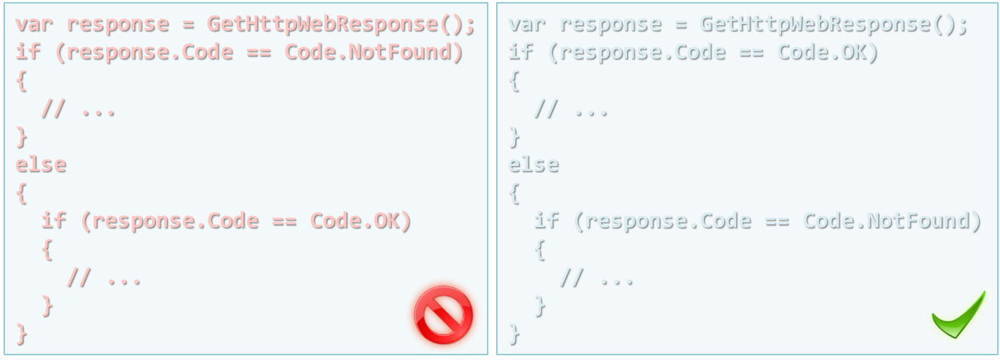 -->
- Start from most common cases first, then go to the unusual ones


<!-- attr: { showInPresentation:true, hasScriptWrapper:true } -->
<!-- # Using Conditional Statements -->
- Avoid comparing to **true** or **false**:
<br />
<br />
<br />
<!-- 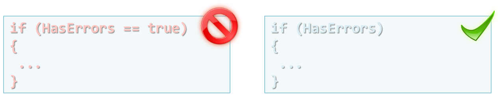 -->
- Always consider the else case
  - If needed, document why the else isn’t necessary

```cs
if (parserState != States.Finished)
{
  // …
}
else
{
  // Ignore all content once the pareser has finished
}
```

<!--  -->


<!-- attr: { showInPresentation:true, hasScriptWrapper:true } -->
<!-- # Using Conditional Statements -->
- Avoid double negation
<br />
<br />
<br />

<!-- 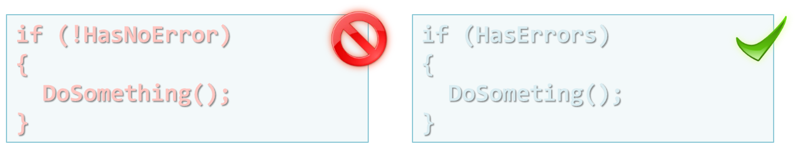 -->


- Write `if` clause with a meaningful statement
<!--  -->
- Use meaningful boolean expressions, which read like a sentence


<!-- attr: { showInPresentation:true, hasScriptWrapper:true } -->
<!-- # Using Conditional Statements -->
- Be aware of copy/paste problems in **if-else** bodies
<!-- 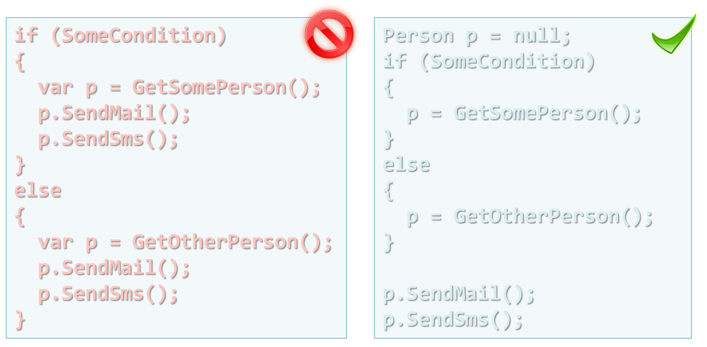 -->


<!-- attr: { showInPresentation:true, hasScriptWrapper:true } -->
# Use Simple Conditions
- Do not use complex `if` conditions
  - You can always simplify them by introducing boolean variables or boolean methods
  - Incorrect example:

```cs
if (x > 0 && y > 0 && x < Width-1 && y < Height-1 &&
  matrix[x, y] == 0 && matrix[x-1, y] == 0 &&
  matrix[x+1, y] == 0 && matrix[x, y-1] == 0 &&
  matrix[x, y+1] == 0 && !visited[x, y]) …
```

  - Complex boolean expressions can be harmful
  - How you will find the problem if you get `IndexOutOfRangeException`?
<!--  -->


<!-- attr: { showInPresentation:true, hasScriptWrapper:true, style:'font-size:0.95em' } -->
# Simplifying Boolean Conditions
- The last example can be easily refactored into self-documenting code:

```cs
bool inRange = x > 0 && y > 0 && x < Width-1 && y < Height-1;
if (inRange)
{
  bool emptyCellAndNeighbours =
    matrix[x, y] == 0 && matrix[x-1, y] == 0 &&
    matrix[x+1, y] == 0 && matrix[x, y-1] == 0 &&
    matrix[x, y+1] == 0;
  if (emptyCellAndNeighbours && !visited[x, y]) …
}
```

- Now the code is:
    - Easy to read – the logic of the condition is clear
    - Easy to debug – breakpoint can be put at the if


<!--  -->


<!-- attr: { showInPresentation:true, hasScriptWrapper:true } -->
<!-- # Simplifying Boolean Conditions -->

- Use object-oriented approach

```cs
class Maze
{
  Cell CurrentCell { get; set; }
  IList<Cell> VisitedCells { get; }
  IList<Cell> NeighbourCells { get; }
  Size Size { get; }

  bool IsCurrentCellInRange()
  {
    return Size.Contains(CurrentCell);
  }

  bool IsCurrentCellVisited()
  {
    return VisitedCells.Contains(CurrentCell);
  }


```  
<!--  -->


<!-- attr: { showInPresentation:true, hasScriptWrapper:true } -->
<!-- # Simplifying Boolean Conditions -->

```cs
  bool AreNeighbourCellsEmpty()
  {
    …
  }
  bool ShouldVisitCurrentCell()
  {
    return
      IsCurrentCellInRange() &&
      CurrentCell.IsEmpty() &&
      AreNeighbourCellsEmpty() &&
      !IsCurrentCellVisited()
  }
}
```

- Now the code:
  - Models the real scenario
  - Stays close to the problem domain
<!--  -->


<!-- attr: { showInPresentation:true, hasScriptWrapper:true } -->
# Use Decision Tables
- Sometimes a **decision table** can be used for simplicity

```cs
var table = new Hashtable();
table.Add("A", new AWorker());
table.Add("B", new BWorker());
table.Add("C", new CWorker());

string key = GetWorkerKey();

var worker = table[key];
if (worker != null)
{
  ...
  worker.Work();
  ...
}
```
<!--  -->


<!-- attr: { showInPresentation:true, hasScriptWrapper:true } -->
# Positive Boolean Expressions
- Starting with a **positive expression** improves the readability
<br />
<br />
<br />
<br />
<br />
<!-- 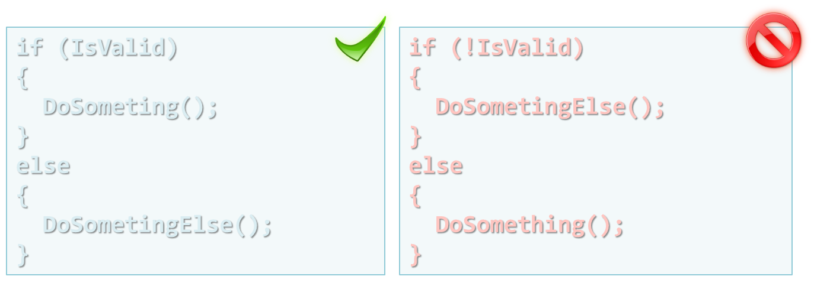 -->

- Use De Morgan’s laws for negative checks
<!-- 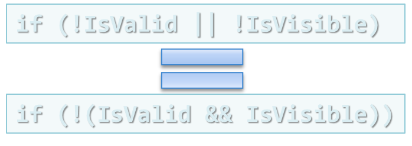 -->


<!-- attr: { showInPresentation:true, hasScriptWrapper:true, style:'font-size:0.95em' } -->
# Use Parentheses
- Avoid complex boolean conditions without parenthesis

```cs
if (a < b && b < c || c == d)
```

- Using parenthesis helps readability as well as ensure correctness

```cs
if (( a < b && b < c ) || c == d)
```
- Too many parenthesis have to be avoided as well
  - Consider separate Boolean methods or variables in those cases
<!--  -->
<!--  -->


<!-- attr: { showInPresentation:true, hasScriptWrapper:true } -->
# Boolean Expression Evaluation
- Most languages evaluate from left to right
  - Stop evaluation as soon as some of the boolean operands is satisfied
  <br />
  <br />
  <br />
  <!-- 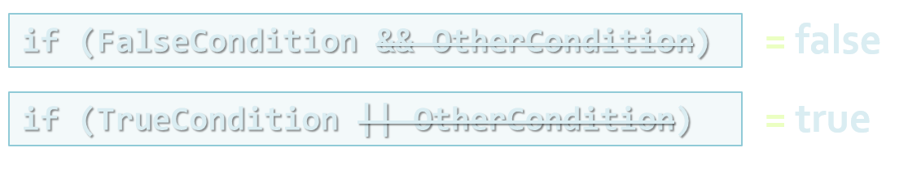 -->

- Useful when checking for **null**

```cs
if (list != null && list.Count > 0) …
```

- There are languages that does not follow this “short-circuit” rule


<!-- attr: { showInPresentation:true, hasScriptWrapper:true } -->
# Numeric Expressions as Operands
- Write numeric boolean expressions as they are presented on a number line
  - Contained in an interval
  <!-- 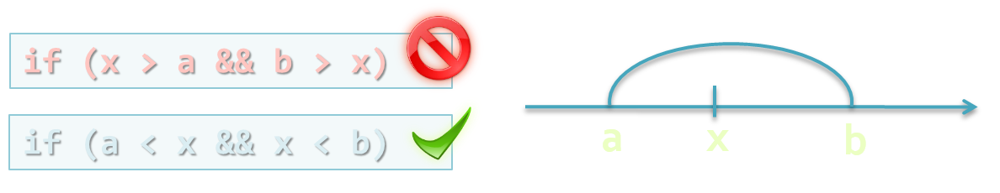 -->
  <br />
  <br />
<br />


  - Outside of an interval
  <!-- 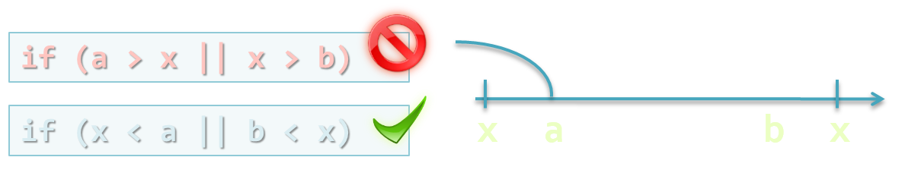 -->


<!-- attr: { showInPresentation:true, hasScriptWrapper:true } -->
# Avoid Deep Nesting of Blocks
- **Deep nesting** of conditional statements and loops makes the code unclear
  - More than 2-3 levels is too deep
  - Deeply nested code is complex and hard to read and understand
  - Usually you can extract portions of the code in separate methods
    - This simplifies the logic of the code
    - Using good method name makes the code self-documenting


<!-- attr: { showInPresentation:true, hasScriptWrapper:true, style:'font-size:0.7em' } -->
# Deep Nesting – _Example_

```cs
if (maxElem != Int32.MaxValue)
{
    if (arr[i] < arr[i + 1])
    {
        if (arr[i + 1] < arr[i + 2])
        {
            if (arr[i + 2] < arr[i + 3])
            {
                maxElem = arr[i + 3];
            }
            else
            {
                maxElem = arr[i + 2];
            }
        }
        else
        {
            if (arr[i + 1] < arr[i + 3])
            {
                maxElem = arr[i + 3];
            }
            else
            {
                maxElem = arr[i + 1];
            }
        }
    }
```
<!--  -->


<!-- attr: { showInPresentation:true, hasScriptWrapper:true, style:'font-size:0.7em' } -->
<!-- # Deep Nesting – _Example_ -->

```cs
    {
        if (arr[i] < arr[i + 2])
        {
            if (arr[i + 2] < arr[i + 3])
            {
                maxElem = arr[i + 3];
            }
            else
            {
                maxElem = arr[i + 2];
            }
        }
        else
        {
            if (arr[i] < arr[i + 3])
            {
                maxElem = arr[i + 3];
            }
            else
            {
                maxElem = arr[i];
            }
        }
    }
}
```


<!--  -->


<!-- attr: { showInPresentation:true, hasScriptWrapper:true, style:'font-size:0.7em' } -->
# Avoiding Deep Nesting – _Example_

```cs
private static int Max(int i, int j)
{
    if (i < j)
    {
        return j;
    }
    else
    {
       return i;
    }
}

private static int Max(int i, int j, int k)
{
    if (i < j)
    {
        int maxElem = Max(j, k);
        return maxElem;
    }
    else
    {
        int maxElem = Max(i, k);
        return maxElem;
    }
}
```
<!--  -->


<!-- attr: { showInPresentation:true, hasScriptWrapper:true, style:'font-size:0.9em' } -->
<!-- # Avoiding Deep Nesting – _Example_ -->

```cs
private static int FindMax(int[] arr, int i)
{
  if (arr[i] < arr[i + 1])
  {
    int maxElem = Max(arr[i + 1], arr[i + 2], arr[i + 3]);
    return maxElem;
  }
  else
  {
    int maxElem = Max(arr[i], arr[i + 2], arr[i + 3]);
    return maxElem;
  }
}

if (maxElem != Int32.MaxValue) {
  maxElem = FindMax(arr, i);
}


```

<!--  -->


<!-- attr: { showInPresentation:true, hasScriptWrapper:true } -->
# Using Case Statement
- Choose the most effective ordering of cases
  - Put the normal (usual) case first
  - Order cases by frequency
  - Put the most unusual (exceptional) case last
  - Order cases alphabetically or numerically
- Keep the actions of each case simple
  - Extract complex logic in separate methods
- Use the default clause in a `case` statement or the last `else` in a chain of `if-else` to trap errors


<!-- attr: { showInPresentation:true, hasScriptWrapper:true, style:'font-size:0.95em' } -->
# Incorrect Case Statement

```cs
void ProcessNextChar(char ch)
{
  switch (parseState)
  {
    case InTag:
      if (ch == ">")
      {
        Console.WriteLine("Found tag: {0}", tag);
        text = "";
        parseState = ParseState.OutOfTag;
      }
      else
      {
        tag = tag + ch;
      }
      break;
    case OutOfTag:
      …
  }
}
```

<!--  -->


<!-- attr: { showInPresentation:true, hasScriptWrapper:true } -->
# Improved Case Statement

```cs
void ProcessNextChar(char ch)
{
  switch (parseState)
  {
    case InTag:
      ProcessCharacterInTag(ch);
      break;
    case OutOfTag:
      ProcessCharacterOutOfTag(ch);
      break;
    default:
      throw new InvalidOperationException(
        "Invalid parse state: " + parseState);
  }
}
```

<!--  -->


<!-- attr: { showInPresentation:true, hasScriptWrapper:true } -->
# Case – Best Practices
- Avoid using fallthroughs
- When you do use them, document them well

```cs
switch (c)
{
  case 1:
  case 2:
    DoSomething();
    // FALLTHROUGH  
  case 17:
    DoSomethingElse();
    break;
  case 5:
  case 43:
    DoOtherThings();
    break;
}
```
<!--  -->


<!-- attr: { showInPresentation:true, hasScriptWrapper:true } -->
<!-- # Case – Best Practices -->
- Overlapping control structures is evil:

```cs
switch (inputVar)
{
  case 'A': if (test)
            {
              // statement 1
              // statement 2
  case 'B':   // statement 3
              // statement 4
              ...
            }
            ...
            break;
}
```

- This code will not compile in C# but may compile in other languages

<!--  -->


<!-- attr: { showInPresentation:true, hasScriptWrapper:true } -->
# Control Statements – Summary
- For simple `if-else`-s, pay attention to the order of the `if` and `else` clauses
  - Make sure the nominal case is clear
- For `if-then-else` chains and `case` statements, choose the most readable order
- Optimize boolean statements to improve readability
- Use the `default` clause in a `case` statement or the last `else` in a chain of `if`-s to trap errors


<!-- section start -->
<!-- attr: { class:'slide-section', showInPresentation:true, hasScriptWrapper:true } -->
<!-- # Using Loops
## Choose Appropriate Loop Type
## and Don’t Forget to Break -->


<!-- attr: { id:'loops', showInPresentation:true, hasScriptWrapper:true } -->
# <a id="loops"></a>Using Loops
- Choosing the correct type of loop:
  - Use `for` loop to repeat some block of code a certain number of times
  - Use `foreach` loop to process each element of an array or a collection
  - Use `while` / `do-while` loop when you don't know how many times a block should be repeated
- Avoid deep nesting of loops
  - You can extract the loop body in a new method

<!-- attr: { showInPresentation:true, hasScriptWrapper:true } -->
# Loops: Best Practices
- Keep loops simple
  - This helps readers of your code
- Treat the inside of the loop as it were a routine
  - Don’t make the reader look inside the loop to understand the loop control
- Think of a loop as a black box:
<!-- 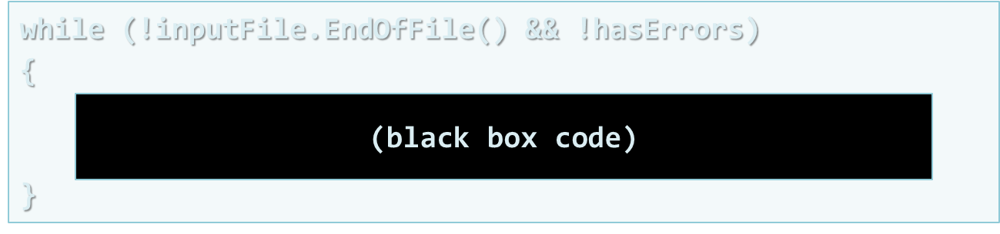 -->


<!-- attr: { showInPresentation:true, hasScriptWrapper:true } -->
<!-- # Loops: Best Practices -->
- Keep loop’s housekeeping at the start or at the end of the loop block

<br />
<br />
- Use meaningful variable names to make loops readable
<!-- 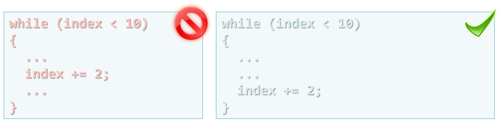 -->
<!-- 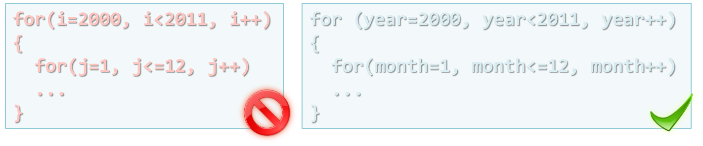 -->


<!-- attr: { showInPresentation:true, hasScriptWrapper:true } -->
<!-- # Loops: Best Practices -->
- Avoid empty loops

```cs
while ((inputChar = Console.Read()) != '\n')
{
}
```

```cs
do
{
   inputChar = Console.Read();
}
while (inputChar != '\n');
```

- Be aware of your language (loop) semantics
  - C# – access to modified closure
<!--  -->
<!--  -->


<!-- attr: { showInPresentation:true, hasScriptWrapper:true } -->
# Loops: Tips on for-Loop
- Don’t explicitly change the index value to force the loop to stop
  - Use `while`-loop with `break` instead
- Put only the controlling statements in the loop header

<!-- 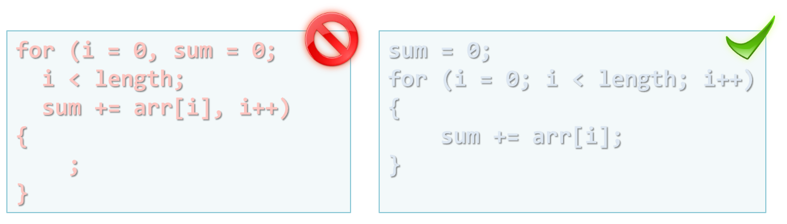 -->


<!-- attr: { showInPresentation:true, hasScriptWrapper:true } -->
<!-- # Loops: Tips on for-Loop -->
- Avoid code that depends on the loop index’s final value
<!-- 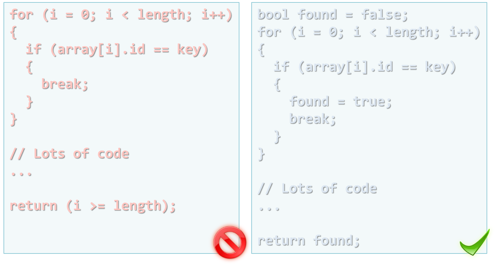 -->


<!-- attr: { showInPresentation:true, hasScriptWrapper:true } -->
# Loops: break and continue
- Use `continue` for tests at the top of a loop to avoid nested `if`-s
- Avoid loops with lots of `break`-s scattered trough it
- Use `break` and `continue` only with caution
<!--  -->


<!-- attr: { showInPresentation:true, hasScriptWrapper:true } -->
# How Long Should a Loop Be?
- Try to make the loops **short enough** to view it all at once (one screen)
- Use methods to shorten the loop body
- Make long loops especially clear
- Avoid deep nestingin loops
<!--  -->


<!-- section start -->
<!-- attr: { class:'slide-section', showInPresentation:true, hasScriptWrapper:true } -->
<!-- # Other Control Flow Structures
## To Understand Recursion,One Must First Understand Recursion -->


<!-- attr: { id:'other', showInPresentation:true, hasScriptWrapper:true } -->
# <a id="other"></a> The return Statement
- Use `return` when it enhances readability
- Use `return` to avoid deep nesting
- Avoid multiple `return`-s in long methods
<!-- 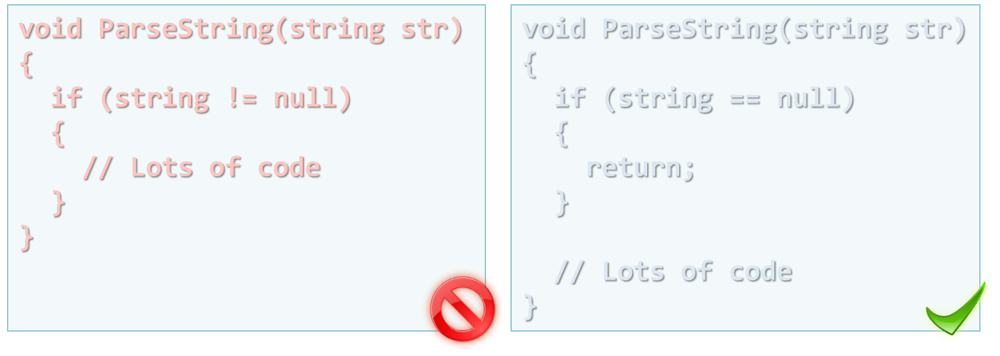 -->


<!-- attr: { showInPresentation:true, hasScriptWrapper:true } -->
# Recursion
- Useful when you want to walk a tree / graph-like structures
- Be aware of infinite recursion or indirect recursion
- Recursion example:

```cs
void PrintWindowsRecursive(Window w)
{
  w.Print()
  foreach(childWindow in w.ChildWindows)
  {
     PrintWindowsRecursive(childWindow);
  }}
```

<!--  -->


<!-- attr: { showInPresentation:true, hasScriptWrapper:true } -->
# Recursion Tips
- Ensure that recursion has end (bottom)
- Verify that recursion is not very high-cost
  - Check the occupied system resources
  - You can always use stack classes and iteration
- Don’t use recursion when there is better **linear** (iteration based) solution, e.g.
  - Factorials
  - Fibonacci numbers
- Some languages optimize tail-call recursions


<!-- attr: { showInPresentation:true, hasScriptWrapper:true } -->
# GOTO
- Avoid `goto`-s, because they have a tendency to introduce spaghetti code
- [“A Case Against the GO TO Statement” by Edsger Dijkstra](http://www.cs.utexas.edu/users/EWD/transcriptions/EWD02xx/EWD215.html)
- Use `goto`-s as a last resort
  - If they make the code more maintainable
- C# supports `goto` with labels, but avoid it!
<!--  -->


<!-- attr: { class:'slide-section', showInPresentation:true, hasScriptWrapper:true } -->
<!-- # HQC-Part 1: Control Flow, Conditional Statements and Loops
## Questions? -->


<!-- attr: { showInPresentation:true, hasScriptWrapper:true } -->
# Free Trainings @ Telerik Academy
- C# Programming @ Telerik Academy
    - [High Quality Code - Part 1](http://academy.telerik.com/student-courses/programming/high-quality-code-part-1/about)
  - Telerik Software Academy
    - [telerikacademy.com](https://telerikacademy.com)
  - Telerik Academy @ Facebook
    - [facebook.com/TelerikAcademy](facebook.com/TelerikAcademy)
  - Telerik Software Academy Forums
    - [forums.academy.telerik.com](forums.academy.telerik.com)
